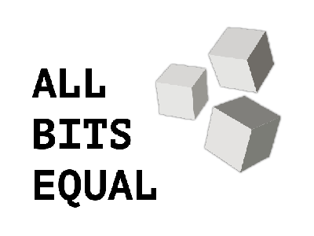

<!-- PROJECT SHIELDS -->
<!--
*** I'm using markdown "reference style" links for readability.
*** Reference links are enclosed in brackets [ ] instead of parentheses ( ).
*** See the bottom of this document for the declaration of the reference variables
*** for contributors-url, forks-url, etc. This is an optional, concise syntax you may use.
*** https://www.markdownguide.org/basic-syntax/#reference-style-links
-->
[![Forks][forks-shield]][forks-url]
[![Stargazers][stars-shield]][stars-url]
[![Issues][issues-shield]][issues-url]
[![MIT License][license-shield]][license-url]
[![LinkedIn][linkedin-shield]][linkedin-url]


<!-- PROJECT LOGO -->
<br />
<p align="center">
  <a href="https://github.com/AllBitsEqual/expo-ts-starter">
    
  </a>

<h3 align="center">expo-ts-starter</h3>

  <p align="center">
    An awesome React Setup to jumpstart your projects!
    <br />
<!--
    <a href="https://github.com/AllBitsEqual/expo-ts-starter"><strong>Explore the docs »</strong></a>
    <br />
    <br />
    <a href="https://github.com/AllBitsEqual/expo-ts-starter">View Demo</a>
    ·
-->
    <a href="https://github.com/AllBitsEqual/expo-ts-starter/issues">Report Bug</a>
    ·
    <a href="https://github.com/AllBitsEqual/expo-ts-starter/issues">Request Feature</a>
  </p>


<!-- TABLE OF CONTENTS -->
<details open="open">
  <summary>Table of Contents</summary>
  <ol>
    <li>
      <a href="#about-the-project">About The Project</a>
      <ul>
        <li><a href="#built-with">Built With</a></li>
      </ul>
    </li>
    <li>
      <a href="#getting-started">Getting Started</a>
      <ul>
        <li><a href="#prerequisites">Prerequisites</a></li>
        <li><a href="#installation">Installation</a></li>
      </ul>
    </li>
    <li><a href="#usage">Usage</a></li>
    <li><a href="#roadmap">Roadmap</a></li>
    <li><a href="#contributing">Contributing</a></li>
    <li><a href="#license">License</a></li>
    <li><a href="#contact">Contact</a></li>
    <li><a href="#acknowledgements">Acknowledgements</a></li>
  </ol>
</details>


<!-- ABOUT THE PROJECT -->
## About The Project

<!--[![Product Name Screen Shot][product-screenshot]](https://example.com)-->

There are many great Project Starter templates available on GitHub, however, I didn't find one that really suit my needs, so I created this enhanced one. This repository uses the Expo Project (using the managed workflow) to easily prototype and even publish apps to both iOS and Android. With Expo for Web being close to the first 1.x release too, this allows me to hit the ground running in new projects.

Here's why:
* Your time should be focused on creating something amazing. A project that solves a problem and helps others
* You shouldn't be doing the same tasks over and over like configuring packages and configs from scratch
* In many cases, combining 2 or 3 packages is easy but once you reach a critical point, it is hard to keep track of which versions play nice with each other

A list of commonly used resources that I find helpful are listed in the acknowledgements.


### Built With

* [Expo]()
* [React Native]()
* [Typescript]()
* [Redux]()
* [Reducks]()
* [React Navigation]()
* A bunch of my own packages that I keep dog-feeding as they progress and I'll add links later


<!-- GETTING STARTED -->
## Getting Started

### Prerequisites

You do not need anything special to start with this project, npm is enough. If you do want to update to newer Expo versions at a later point, you will need to install the expo cli though.
* npm
  ```sh
  npm install npm@latest -g
  ```
* expo cli
  ```sh
  npm install expo-cli -g
  ```
  
### Installation

To get started using this repository you simply have to download, clone or fork it, navigate your command line tool to the project root and run `npm install` to install all requirements.

Once that task is completed, you can run `npm start` to initialise the Expo Bundler and Web Interface and start hacking.

1. Clone the repo
   ```sh
   git clone https://github.com/your_username_/Project-Name.git
   ```
2. Install NPM packages
   ```sh
   npm install
   ```
3. Start the expo bundler and web interface
   ```sh
   npm start
   ```
   


<!-- USAGE EXAMPLES -->
## Usage

The idea of this project is to have a bunch of examples ready to use. This means that in addition to the source folder there will be a demo folder containing examples to work with and test the waters.

_For more examples, I can only recommend you to follow me on [allbitsequal.medium.com](https://allbitsequal.medium.com/)_


<!-- ROADMAP -->
## Roadmap

- [x] Typescript and Linting
- [ ] Redux & Reducks
- [ ] React Navigation
- [ ] Animated Navigation transitions
- [ ] ... and many other features!

See the [open issues](https://github.com/AllBitsEqual/expo-ts-starter/issues) for a list of requested features (and known issues).


<!-- CONTRIBUTING -->
## Contributing

Contributions are what make the open source community such an amazing place to be learn, inspire, and create. Any contributions you make are **greatly appreciated**.

1. Fork the Project
2. Create your Feature Branch (`git checkout -b feature/AmazingFeature`)
3. Commit your Changes (`git commit -m 'Add some AmazingFeature'`)
4. Push to the Branch (`git push origin feature/AmazingFeature`)
5. Open a Pull Request


<!-- LICENSE -->
## License

Distributed under the MIT License. See `LICENSE` for more information.


<!-- CONTACT -->
## Contact

Konrad Abe - [@AllBitsEqual](https://twitter.com/AllBitsEqual)

Project Link: [https://github.com/AllBitsEqual/expo-ts-starter](https://github.com/AllBitsEqual/expo-ts-starter)


<!-- ACKNOWLEDGEMENTS -->
## Acknowledgements
* [Best-README-Template](https://github.com/othneildrew/Best-README-Template)
* [GitHub Emoji Cheat Sheet](https://www.webpagefx.com/tools/emoji-cheat-sheet)
* [Img Shields](https://shields.io)
* [Choose an Open Source License](https://choosealicense.com)
* [GitHub Pages](https://pages.github.com)


<!-- MARKDOWN LINKS & IMAGES -->
<!-- https://www.markdownguide.org/basic-syntax/#reference-style-links -->
[forks-shield]: https://img.shields.io/github/forks/AllBitsEqual/expo-ts-starter.svg?style=for-the-badge
[forks-url]: https://github.com/AllBitsEqual/expo-ts-starter/network/members
[stars-shield]: https://img.shields.io/github/stars/AllBitsEqual/expo-ts-starter.svg?style=for-the-badge
[stars-url]: https://github.com/AllBitsEqual/expo-ts-starter/stargazers
[issues-shield]: https://img.shields.io/github/issues/AllBitsEqual/expo-ts-starter.svg?style=for-the-badge
[issues-url]: https://github.com/AllBitsEqual/expo-ts-starter/issues
[license-shield]: https://img.shields.io/github/license/AllBitsEqual/expo-ts-starter.svg?style=for-the-badge
[license-url]: https://github.com/AllBitsEqual/expo-ts-starter/blob/master/LICENSE.txt
[linkedin-shield]: https://img.shields.io/badge/-LinkedIn-black.svg?style=for-the-badge&logo=linkedin&colorB=555
[linkedin-url]: https://linkedin.com/in/konrad-abe/
<!-- [product-screenshot]: images/screenshot.png -->
